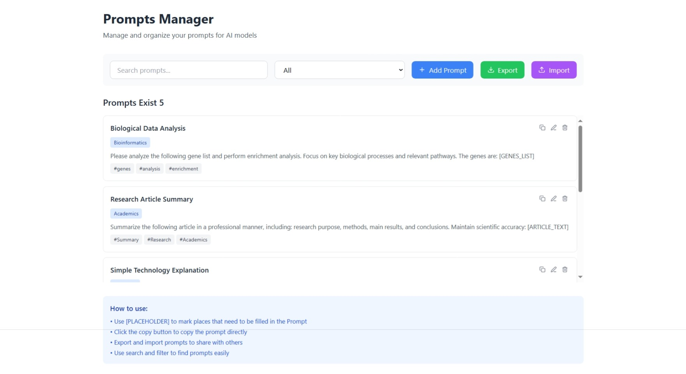

#  Prompts Manager

Prompts Manager is a lightweight and intuitive interface for organizing, editing, and sharing AI prompts. Whether you're working with GPT models or other LLMs, this tool helps streamline your workflow and keep your prompt library clean and accessible.

## ✨ Features

- 🔍 Search and filter prompts by tags
- 📋 Quick copy functionality for prompt text
- 📦 Import/export prompts for easy sharing
- 🧩 Support for `[PLACEHOLDER]` syntax to mark dynamic input areas
- 🗂️ Categorize prompts by use case, tone, or model type

## 🚀 Use Cases

- Build a personal prompt library for AI tools
- Collaborate with teams on prompt engineering
- Customize responses by language, style, or structure
- Rapid prototyping of chatbot or assistant behaviors

## 🖼️ Screenshot




## 📦 Installation

Clone the repository and install dependencies:

```bash
git clone https://github.com/your-username/prompts-manager.git
cd prompts-manager
npm install


